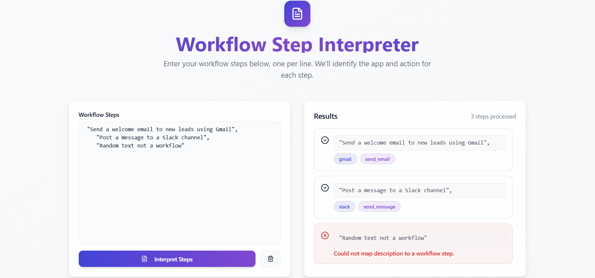

 Workflow Step Detection API

## Overview

This project delivers an API service that interprets plain text descriptions of workflow steps and leverages a Large Language Model (LLM) to determine:

- The appropriate app to use for each workflow step (e.g., Gmail, Slack, Hubspot).
- The specific action associated with the step (e.g., send_email, forward_email).

The API flags unsupported or private apps and actions and prompts users when input text does not describe a valid workflow step.



---

## 🏗️ Project Structure

```
WorkFlow_Detect/
├── Frontend/          # Type Script React frontend application
│   ├── public/              # Public assets
│   ├── src/                 # Source code
│   │   ├── components/      # React components
│   │   ├── pages/          # Page components
│   ├── package.json        # Frontend dependencies
│   └── README.md           # Frontend documentation
│
├── Backend-api/            # FastAPI backend application
│   ├── src/                # Application code
│   │   ├── api/            # API routes
│   │   ├── models/         # Data models
│   │   ├── services/       # Business logic
│   ├── tests/              # Backend tests
│   ├── requirements.txt    # Python dependencies
│   ├── Dockerfile          # Docker configuration
│   ├── .dockerignore       # Docker ignore file
│   └── README.md           # Backend documentation
│
└── docs/                   # Documentation
    └── api/                # API documentation
```

## 🚀 Features

- **Workflow Detection**: Advanced algorithms to identify and analyze workflow patterns
- **Real-time Monitoring**: Live tracking of workflow execution and performance
- **Interactive Dashboard**: Typescript frontend for visualization and management
- **RESTful API**: FastAPI backend with comprehensive API endpoints
- **Docker Support**: Containerized deployment for easy setup and scaling
- **Modern Tech Stack**: Built with Typescript React, FastAPI, and modern development practices

## 🛠️ Technology Stack

### Frontend
- **React**: Modern JavaScript framework for building user interfaces
- **JavaScript/TypeScript**: Core programming languages
- **CSS3**: Styling and responsive design
- **Node.js**: JavaScript runtime environment

### Backend
- **FastAPI**: Modern, fast web framework for building APIs with Python
- **Python 3.8+**: Core programming language
- **Pydantic**: Data validation and settings management
- **Uvicorn**: ASGI server for running the application

### DevOps & Deployment
- **Docker**: Containerization for consistent deployment
- **Git**: Version control system

## 📋 Prerequisites

Before running this project, make sure you have the following installed:

- **Node.js** (v14.0.0 or later)
- **npm** or **yarn**
- **Python** (3.8 or later)
- **pip** (Python package installer)
- **Docker** (optional, for containerized deployment)

## 🚀 Quick Start

### Backend Setup

1. **Navigate to the backend directory:**
   ```bash
   cd Backend-api
   ```

2. **Create a virtual environment:**
   ```bash
   python -m venv venv
   ```

3. **Activate the virtual environment:**
   ```bash
   # Windows
   venv\Scripts\activate
   
   # macOS/Linux
   source venv/bin/activate
   ```

4. **Install dependencies:**
   ```bash
   pip install -r requirements.txt
   ```

5. **Run the backend server:**
   ```bash
   $env:OPENAI_API_KEY = "your-api-key-here"
   uvicorn app.main:app --reload --host 0.0.0.0 --port 8000
   
   ```
   or 

   ```bash
   python -m uvicorn src.main:app --reload --host 0.0.0.0 --port 8000
   
   ```

The backend API will be available at `http://localhost:8000`

### Frontend Setup

1. **Navigate to the frontend directory:**
   ```bash
   cd Frontend-react
   ```

2. **Install dependencies:**
   ```bash
   npm install
   # or
   yarn install
   ```

3. **Start the development server:**
   ```bash
   npm start
   # or
   yarn start
   ```

The frontend application will be available at `http://localhost:8080`

## 🐳 Docker Deployment

### Backend Docker Setup

1. **Navigate to the backend directory:**
   ```bash
   cd Backend-api
   ```

2. **Build the Docker image:**
   ```bash
   docker build -t workflow-detect-backend .
   ```

3. **Run the container:**
   ```bash
   docker run -p 8000:8000 workflow-detect-backend
   ```

### Using Docker Compose (Recommended)

Create a `docker-compose.yml` file in the root directory:

```yaml
version: '3.8'
services:
  backend:
    build: ./Backend-api
    ports:
      - "8000:8000"
    environment:
      - ENVIRONMENT=production
    
  frontend:
    build: ./Frontend-react
    ports:
      - "3000:3000"
    depends_on:
      - backend
```

Run with:
```bash
docker-compose up --build
```

## 📖 API Documentation

Once the backend is running, you can access:

- **Interactive API Docs (Swagger UI)**: `http://localhost:8000/docs`


## 🧪 Testing

### Backend Testing
```bash
cd Backend-api
pytest
```


## 🐛 Troubleshooting

### Common Issues

1. **Port conflicts**: Make sure ports are available
2. **CORS issues**: Backend includes CORS middleware for development
3. **Python dependencies**: Use virtual environment to avoid conflicts
4. **Node modules**: Delete `node_modules` and run `npm install` if issues persist


## 🔗 Links

- [FastAPI Documentation](https://fastapi.tiangolo.com/)
- [React Documentation](https://reactjs.org/)
- [Docker Documentation](https://docs.docker.com/)

---

**Note**: This is an interview project for Zapier. The application demonstrates modern full-stack development practices and workflow detection capabilities.